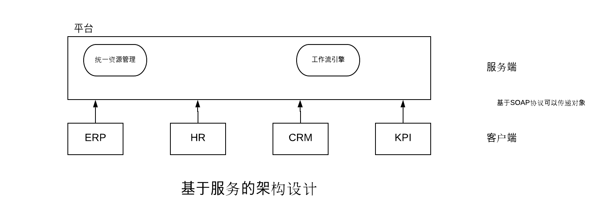

# Webservices
## 1. Introduction

Simple words, services that can be accessed over network called web services, platform independent, programming language independent. 适用于不同系统之间的数据传递。

## 2. Types of Web Services

- <strong>SOAP</strong>简单对象访问协议: simple object access protocol. SOAP is an XML based industry standard protocol for designing and developing web services. Since it's XML based, it's platform and language independent. 
- <strong>RESTful</strong>: REST is an architectural style of developing web services. It's getting popularity recently because it has small learning curve when compared to SOAP. 

## 3. Java Web Services

Java provides it's own API to create both `SOAP` as well as `REST` web services. 

+ <strong>JAX-WS</strong>: JAX-WS stands for JAVA API for XML Web Service. JAX-WS is XML based Java API to build web serivices server and client application. 
+ <strong>JAX-RS</strong>: Java API for Restful Web Services is the Java API for creating REST(Representation state Transfer) web services. JAX-RS uses annotations to simplify the development and development of web services. 

Both of these APIs are part of standard JDK installation. 

SOAP协议，用于交换XML编码信息的轻量级协议。主要有三个方面：XML-Envelop为描述信息内容和如何处理内容定义了框架。 

SOAP就是HTTP协议的基础上+XML数据。

SOAP的组成：

- Envelope 必须的部分，以XML根元素出现
- Headers 可选的
- Body 必须的
  1. WSDL语言：Webservice Definition Language， used to describe web services, written in XML. 

| Element     | Description                                                  |
| ----------- | ------------------------------------------------------------ |
| \<type>     | Defines the data types used the webservice                   |
| \<message>  | Defines the data elements for each operation                 |
| \<portType> | Describes the operations that can be performed and the messages involved. |
| \<binding>  | Defines the protocol and data format for each port type      |

A request-response operation example: 

```xml
<message name="getTermRequest">
  <part name="term" type="xs:string"/>
</message>

<message name="getTermResponse">
  <part name="value" type="xs:string"/>
</message>

<portType name="glossaryTerms">
  <operation name="getTerm">
    <input message="getTermRequest"/>
    <output message="getTermResponse"/>
  </operation>
</portType>

<binding type="glossaryTerms" name="b1">
   <soap:binding style="document"
   transport="http://schemas.xmlsoap.org/soap/http" />
   <operation>
     <soap:operation soapAction="http://example.com/getTerm"/>
     <input><soap:body use="literal"/></input>
     <output><soap:body use="literal"/></output>
  </operation>
</binding>
```


2. UDDI: Universial Description, Discovery and Integration. 

an XML-based standard for describing, publishing, and finding web services. WEB服务提供商将自己开发的Web服务发布到网上的规范。

- UDDI is a specification for a distributed registry of web services. 
- UDDI is a platform-independent, open framework. 
- UDDI can communicate via SOA.
- UDDI uses WSDL to describe interfaces to web services. 

3. WebService 应用场景



4. 优缺点：

   - 异构平台的互通性：不同的硬件平台，不同的操作系统，不同的软件，不同的协议通信。
   - 更广泛的软件复用：
   - 成本低，可读性应用范围广
   - 敏捷开发

   缺点：

   - SOAP协议会传输XML文件随带一些多余的数据，造成空间的浪费。

5. SOA(Service-Oriented Architecture)面向服务的架构

   并不是一种技术，而是一种分布式运算的软件设计方法。is a style of software design where services are provided to the other components by application components, through a communication protocol over a network. 

   Implementation approaches: 

   - Web Services based on WSDL and SOAP
   - Messaging, `JMS`
   - Restful HTTP
   - … 

## 4. Apache CXF Framework

Apache CXF is an open source services framework. CXF helps you build and develop services using frontend programming APIs, like JAX-RS and JAX-WS. WebService的实现框架。

使用这个CXF框架，需要基本实现两部分，先实现服务端，然后再实现客户端的部分。

###4.1 实现服务端

1. 创建Maven工程，添加依赖`pom.xml`。

```xml
<dependencies>
		<dependency>
			<groupId>junit</groupId>
			<artifactId>junit</artifactId>
			<version>4.11</version>
			<scope>test</scope>
		</dependency>

		<!-- Apache jax-ws -->
		<dependency>
			<groupId>org.apache.cxf</groupId>
			<artifactId>cxf-rt-frontend-jaxws</artifactId>
			<version>3.3.2</version>
		</dependency>

		<!-- Embedded Jetty -->
		<!-- https://mvnrepository.com/artifact/org.apache.cxf/cxf-rt-transports-http-jetty -->
		<dependency>
			<groupId>org.apache.cxf</groupId>
			<artifactId>cxf-rt-transports-http-jetty</artifactId>
			<version>3.3.2</version>
		</dependency>

		<!-- https://mvnrepository.com/artifact/org.slf4j/slf4j-log4j12 -->
		<dependency>
			<groupId>org.slf4j</groupId>
			<artifactId>slf4j-log4j12</artifactId>
			<version>1.7.26</version>
			<scope>test</scope>
		</dependency>

	</dependencies>
```

2. 创建一个注入`webservice`的接口，然后实现这个接口。

```java
package com.frank.service;

import javax.jws.WebService;

/**
 * Public Service
 * @author xwang
 *
 */
// Add Annotation 
@WebService
public interface IHelloService {
	
	/**
	 * Function: say hello
	 */
	public String sayHello(String name);
}

```

实现这个接口：

```java
package com.frank.service.impl;

import com.frank.service.IHelloService;

/**
 * Implement HelloService
 * @author xwang
 *
 */
public class HelloService implements IHelloService {

	@Override
	public String sayHello(String name) {
		return name + ", Welcome to WebService";
	}

}

```

3. 创建测试类，开启发布服务：

```java
package com.frank.test;

import org.apache.cxf.jaxws.JaxWsServerFactoryBean;

import com.frank.service.impl.HelloService;

public class Server {
	public static void main(String[] args) {
		// Factory 
		JaxWsServerFactoryBean factoryBean = new JaxWsServerFactoryBean();
		
		// Set Address
		factoryBean.setAddress("http://localhost:8888/ws/hello");
		
		// Set Service class
		factoryBean.setServiceBean(new HelloService());
		
		// Release Service 
		factoryBean.create();
		
		// End
		System.out.println("End!!!");
	}
}

```

4. 使用地址`http://localhost:8888/ws/hello?wsdl` 访问WSDL说明说。

### 4.2 实现客户端

使用服务，需要有服务的文档。

 此时需要理解一下代理对象。Java中的代理有两种：1.静态代理；2.动态代理（jdk接口代理、cglib子类代理）

1. 创建`jax_ws_client` maven项目

2. 创建接口`IHelloService`, 并且要与Server端的相同。

3. 创建一个测试类，来对远程的Server方法进行访问：

   ```java
   package com.frank.client.test;
   
   import org.apache.cxf.jaxws.JaxWsProxyFactoryBean;
   
   import com.frank.service.IHelloService;
   
   public class Client {
   	public static void main(String[] args) {
   		// Address
   		
   		// Create CXF proxy factory 
   		JaxWsProxyFactoryBean factoryBean = new JaxWsProxyFactoryBean();
   		
   		// Set Remote Web Service Address
   		factoryBean.setAddress("http://localhost:8888/ws/hello");
   		
   		// Set Service Class
   		factoryBean.setServiceClass(IHelloService.class);
   		
   		// Create Proxy Object
   		IHelloService helloService = factoryBean.create(IHelloService.class);
   		
   		// Access Service Methods
   		System.out.println(helloService.sayHello("Frank "));
   	}
   }
   
   ```

   Note: <b>这里需要看一下代理模式的设计模式</b>

   